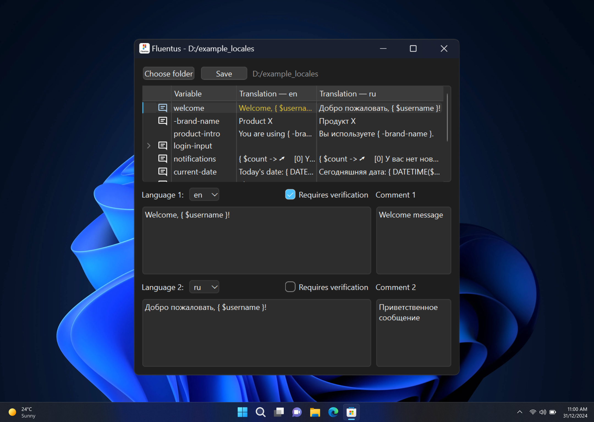

# fluentus
[](https://github.com/m-xim/fluentus/releases/latest)
[](https://github.com/m-xim/fluentus/actions)
[](https://github.com/m-xim/fluentus/actions)
[](https://github.com/m-xim/fluentus/blob/main/LICENSE)
[](https://projectfluent.org/)

[//]: # (## About)
Fluentus is a powerful tool designed to edit the Fluent localization files from [Project Fluent](https://projectfluent.org)

> [!WARNING]
> Fluentus is currently in beta stage. Please proceed with caution and ensure to back up your localization files before using Fluentus.



## Usage
To run the project, download the latest release from the [Releases](https://github.com/m-xim/fluentus/releases) page. Choose the version for your platform (Windows, macOS, Linux) and run the downloaded file.

<details>
<summary>Run from source</summary>

To run the project from source, follow these steps:
1. Clone the repository: `git clone https://github.com/m-xim/fluentus.git`
2. Navigate to the project directory: `cd fluentus`
3. Install the dependencies: `pip install -r requirements.txt`
4. Run the project: `python src/app.py`
</details>

## Localization Files Structure
The localization files are organized into language-specific directories. Each directory contains Fluent Translation List (FTL) files and subdirectories as needed.

```plaintext
locales/
├── en/       # English localization files
│   ├── example.ftl
│   └── subfolder/
│       └── another_example.ftl
├── ru/       # Russian localization files
│   ├── example.ftl
│   └── subfolder/
│       └── another_example.ftl
└── ...       # Other language
```

> [!TIP]
> Download the `example_locales` folder from the repository. This folder contains the localization files that you can use to test and understand how Fluentus works.

## Contributing
We welcome contributions! To contribute:
1. Fork the repository.
2. Create a new branch: 
   `git checkout -b feature/your-feature-name`
3. Make your changes and submit a pull request.

## Development
<details>
<summary>Building</summary>

To building the project, follow these steps:
1. Clone the repository: `git clone https://github.com/m-xim/fluentus.git`
2. Navigate to the project directory: `cd fluentus`
3. Create a virtual environment `python -m venv venv`
4. Activate the virtual environment:
   * Windows: `venv\Scripts\activate`  
   * Linux, macOS: `source venv/bin/activate`
5. Install the dependencies: `pip install -r requirements.txt`
6. Building the project: `python src/app.py`
   * Main Version: `pyinstaller main.spec`
   * Debug Version: `pyinstaller dev.spec`
</details>